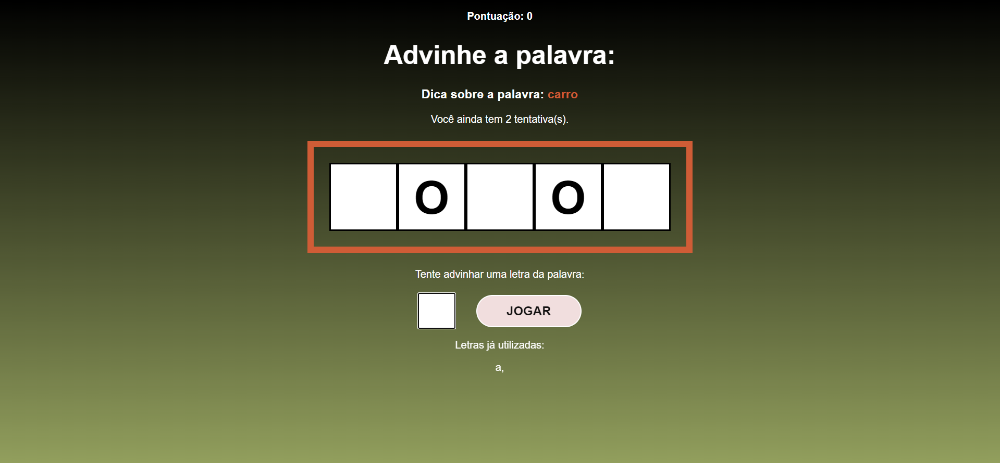
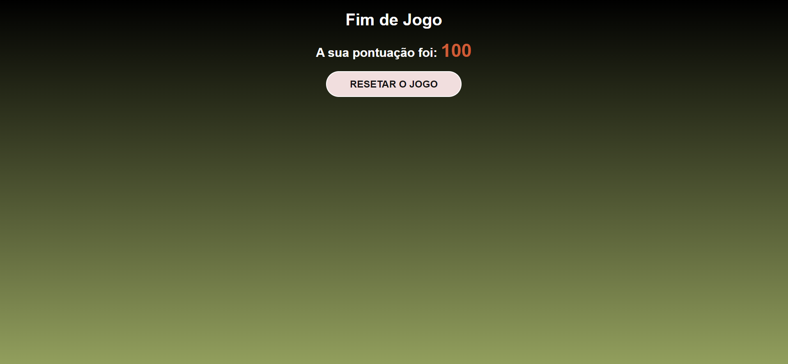

<h1 align="center">Secret Word</h1>

## :memo: Descrição
Projeto desenvolvido em React no. É um aplicativo desenvolvido nos moldes de programas de TV na qual o usuário tem que acertar a palavra secreta na tela, informando letras. O usuário tem 3 tentativas para acertar as palavras, e ao fim ele é levado a tela final, onde é exibida a pontuação e onde ele pode retornar a primeira página.

## :framed_picture: Fotos
<div display="flex">
    
    
    
</div>

## :wrench: Tecnologias utilizadas
* React
* JavaScript

## :rocket: Como rodar:

### Instalação

Para rodar o repositório é necessário clonar o mesmo:
```
git clone https://github.com/lucasbf7/Secret-Word
```
Feito isso, abra o projeto e vá para a pasta com:
```
cd secret-word
```
E então execute o projeto:
```
npm run dev
```

E pronto!